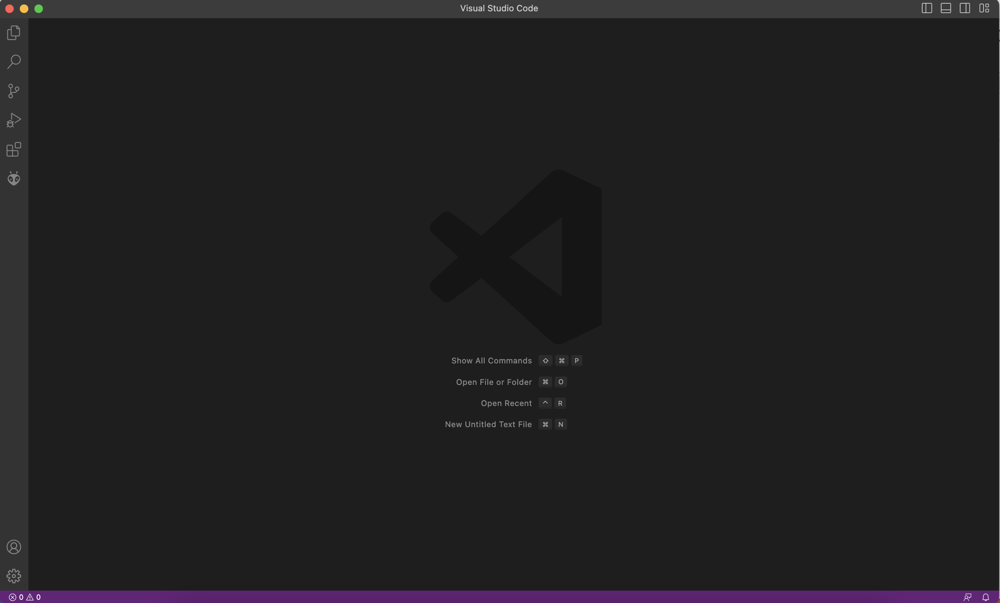
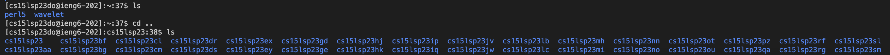
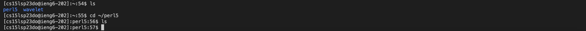

# How to Log into a Course Specific Account on ieng6

**1. Install Visual Studio Code**

Go to the Visual Studios website using the link [https://code.visualstudio.com](https://code.visualstudio.com/). Download the version of Visual Studios that corresponds to your operationing system (macOS or Windows) as seen in the below image.

Access Visual Studios in the applications folder of your computer when it is finished downloading. When VS is opened should look like the below image.

**2. Remotely Connect**

To remotely connect to the server use the ssh command. Type `ssh cs15lsp23zz@ieng6.ucsd.edu` in the terminal and substitute `zz` for the letters associated with your personal account. Answer "yes" to the printed message (When connecting for the first time) and enter the password to your account (**The letters typed will not appear for security reasons but are still being inputted**). The interaction should look like the below image.

**3. Try Some Commands**

Commands can be run in the terminal to access different paths and directories. Some examples commands to try are `cd`, `ls`, and `pwd`. Below are a few examaple commands:

The `ls` command lists the files and folders of the given path. `ls -a` will also list the hidden files in the path.

The `cd` command changes the current working directory to the given path (The `..` removes one directory from the current path)

The `cd ~/` command adds another directory to the path

