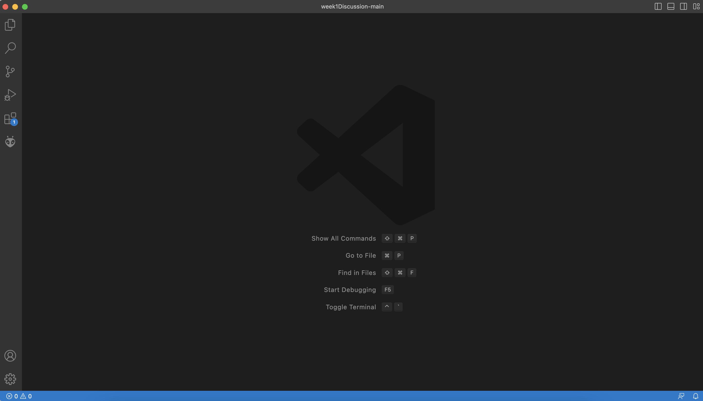

# How to Log into a Course Specific Account on ieng6

1. Install Visual Studio Code
  - Go to the Visual Studios website using the link https://code.visualstudio.com/
  - Download the version of Visual Studios that corresponds to your operationing system (macOS or Windows)
  - When the application

2. Remotely Connect

3. Try Some Commands
