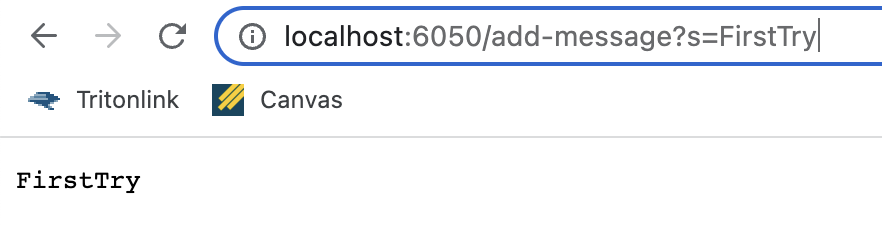
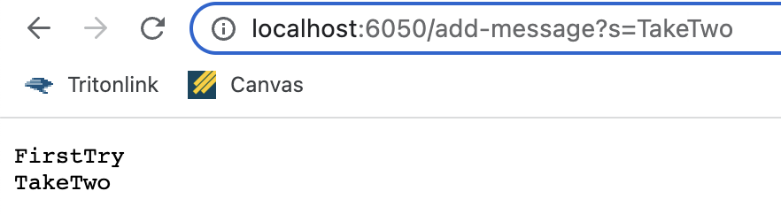

**Lab 2**

**Part 1:**
String Server Code:
  
  

  
  
  
**Part 2:**
  
  Failed JUnit Test:
  
  
  Passed JUnit Test:
  
  
  Code Before:
  ```
  static void reverseInPlace(int[] arr) {
      for(int i = 0; i < arr.length; i += 1) {
        arr[i] = arr[arr.length - i - 1];
      }
    }
  ```
  
**Part 3:**
  During week 2 in lab I learned how to create a web server that could be altered depending on what was written in the URL. By the end of the lab session I   had implemented a counter that counted when an add command was entered in the URL and also have my server appear on someone else's computer.
