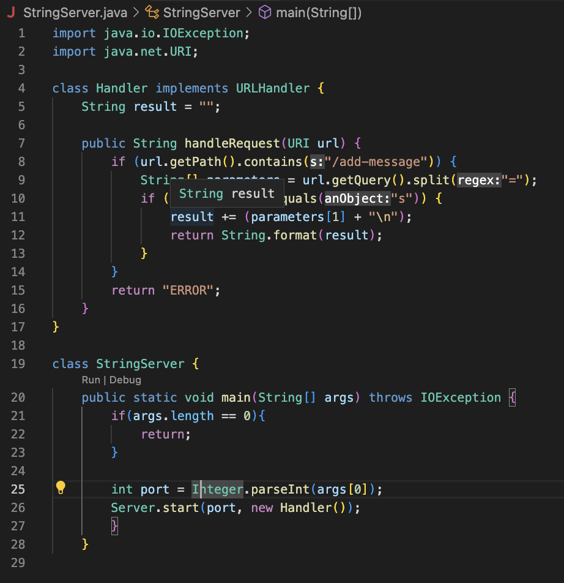

**Lab 2**

**Part 1:**  

String Server Code:
  
  
    
  Run 1:  
  When the request `/add-message?s=FirstTry` is inputted the handleRequest and main method are called. The handleRequest method has the parameter `url` which is the string inputted in the search bar and begins with an empty string called `result`. The main method has a parameter `args` where the first element is the number of the localhost server. The only value that changes is the `result` string in the handleRequest method. It starts as an empty string and concatenates the `FirstTry` and `\n` to the string (The "\n" signifies a new line).  
    
  
  
  Run 2:  
  When the request `/add-message?s=TakeTwo` is inputted the handleRequest and main method are called. The parameters are the same, but the `result` string is holding the value from the first input (`FirstTry\n`). The `result` string then concatenates `TakeTwo` and `\n` to the existing `result` string.
    
  
  
  
**Part 2:**
  
  Failed JUnit Test:
  
  
  Non-failure JUnit Test:  
  
  
  Code Before Fix:
  ```
  static void reverseInPlace(int[] arr) {
      for(int i = 0; i < arr.length; i += 1) {
        arr[i] = arr[arr.length - i - 1];
      }
    }
  ```
  
  Code After Fix:
  ```
  static void reverseInPlace(int[] arr) {
      for(int i = 0; i < arr.length/2; i += 1) {
        int temp = arr[i];
        arr[i] = arr[arr.length - i - 1];
        arr[arr.length - i - 1] = temp;
      }
    }
   ```
  
**Part 3:**
  During week 2 in lab I learned how to create a web server that could be altered depending on what was written in the URL. By the end of the lab session I   had implemented a counter that counted when an add command was entered in the URL and also have my server appear on someone else's computer.
