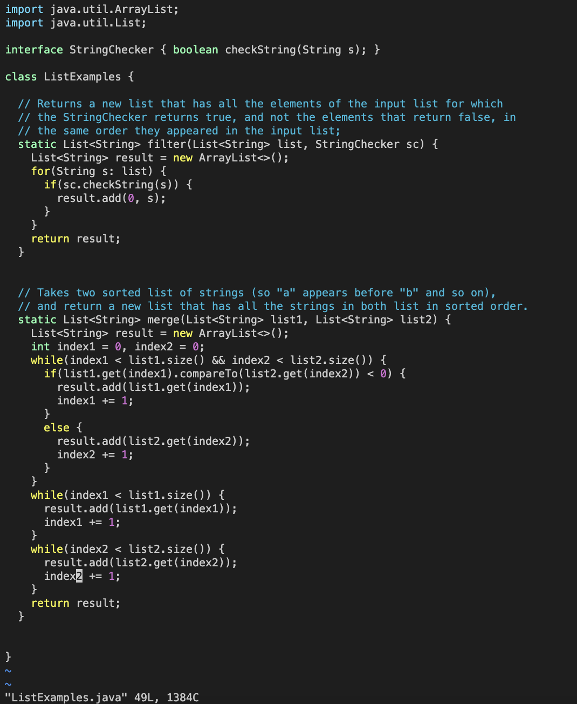

**Lab 4**

**Steps:**

4.

Keys pressed: `ssh <space> cs15lsp23do@ieng6.ucsd.edu <enter>`

Log into ieng6 using the ssh command.
  
5.

Keys pressed: `git <space> clone <space> <ctrl> c <ctrl> v <enter>`
  
Fork the repository and then use the `git clone` command and copy and paste the link from github.
  
6.

Keys pressed: `cd <space> lab7 <enter> bash <space> test.sh <enter>`
  
Run the bash file test.sh that has the JUnit Test commands. The tester file fails one test.
  
7.

Keys pressed: `vim <space> ListExamples.java <enter> 42 <enter> e r 2 : w q <enter>`
  
Enter the vim command with ListExamples.java. Type 42 <enter> to move 42 lines down. Type e to move to the end of the word index1. r 2 replaces the 1 in index1 with a 2.
Finally, :wq saves and quits vim.
  
8.

Keys pressed: `<up> <up> <enter>`
  
Rerun the same bash test.sh by going up twice in the search history. Both tests pass.
  
9.

Keys pressed: `git <space> commit <space> ListExamples.java <enter> ListExamples.java <space> edit : w q <enter> git <space> push <enter>`
  
Committed the file ListExamples.java with the message "ListExamples.java edit" by using `git commit`. Push the edit to Github using `git push`.

