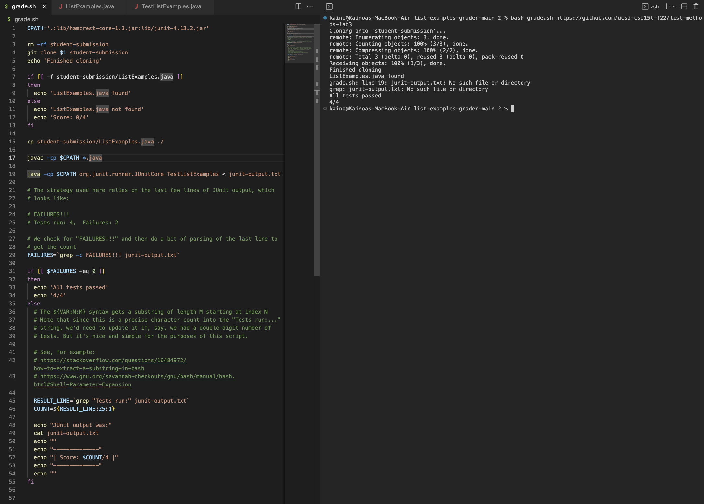
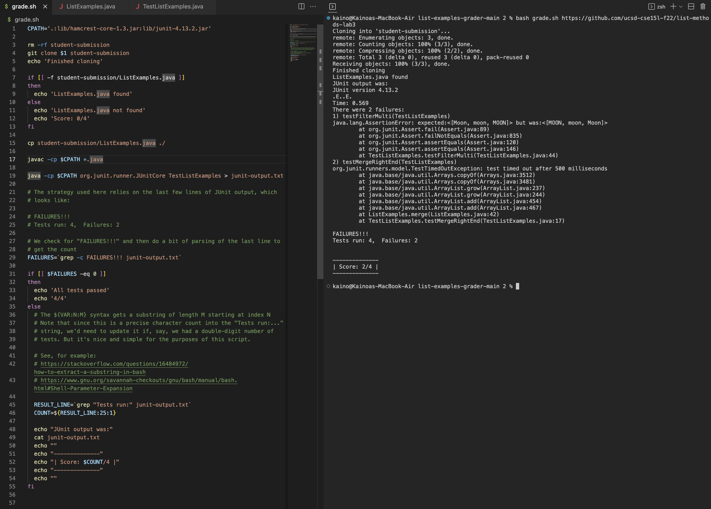

**Lab 5**

**Part 1:**
Student Bug:

*What environment are you using (computer, operating system, web browser, terminal/editor, and so on)?*

I am using Visual Studios Code on a Mac.

*Detail the symptom you're seeing. Be specific; include both what you're seeing and what you expected to see instead. Screenshots are great, copy-pasted terminal output is also great. Avoid saying “it doesn't work”.*

When I run the bash script the terminal says that I pass all the tests (4/4), but the script should only pass 2/4. It also says that junit-output.txt does not exist.

*Detail the failure-inducing input and context. That might mean any or all of the command you're running, a test case, command-line arguments, working directory, even the last few commands you ran. Do your best to provide as much context as you can.*

I had just opened the code and ran the `bash grade.sh <git repository>` command. It says that the ListExamples.java file was found but junit-output.txt does not exist.

1. Try to look at where the junit-output.txt file is created and specifically what command in the bash script creates it.

2. The error with the code was that I used a `<` to redirect the grep output as opposed to a `>`. This meant that the script tried to input a nonexistant junit-output.txt file into the grep command as opposed to redirecting the output into a newly created junit-output.txt.

3. To setup this I downloaded the correct grade.sh and TestListExamples files. I then used the `bash grade.sh <git repository>` command to test the grader on an already broken ListExamples file. To fix the bug I switched the `<` to a `>`. This redirected the output as opposed to the input and creates the junit-output.txt file.

**Part 2:**

During labs I was able to get a hands on experience with the topics that we learned in lecture. The biggest aspect of this was learning how to engage with files without using Visual Studios. I did not think it was possible to run these files, but with vim and the terminal it is. Labs gave me the opportunity to practice vim and learn more of the applications and customization of it.

